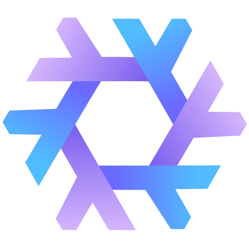

# △ NixOS Config △
- Not meant to be plugin for other people due to sops integration with login, although my hope is others can refer to this who are trying to get started with some of the things I do here.
- If you are one of those mentioned in the credits here and don't want to be mentioned, just let me know.

# Things I do
- Hopefully straightforward use of [Hjem](https://github.com/feel-co/hjem).
- Flakes with flake parts pointing to outputs/default.nix
- Impermanence in system and home. Per module persistance so wm switches don't pollute user space.
- Sops dependent install process, bring your own keys, secrets.
- Coupled user/system modules, inspired by [saygo's](https://github.com/saygo-png/nixos) configuration.
- Some code here, such as the gtk module, and impermanence module is --stolen-- borrowed from [iynaix's](https://github.com/iynaix/dotfiles) config

## Important Files
- [Flake entrypoint](flake.nix)
- [NixosConfigurations & HM Module](outputs/nixos-configs.nix)

# Credits
 For collectively dragging me, kicking and screaming, across multiple finish lines
- [Jet](https://github.com/Michael-C-Buckley/home-config)
- [Iynaix](https://github.com/iynaix/dotfiles)
- [Saygo](https://github.com/saygo-png/nixos)
- [Tony, BTW](https://www.tonybtw.com/)
- [Emzy](https://github.com/emzywastaken/dotfiles)

  

